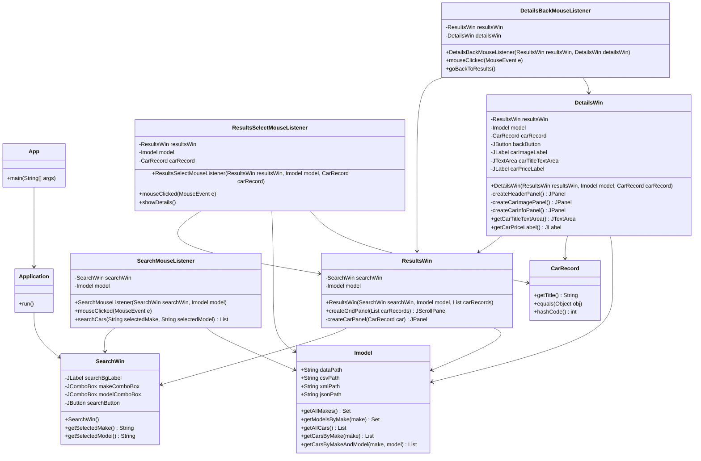

### Initial Design

The initial design focused on car search and viewing functionalities. The Model handles data retrieval. 
The View provides the GUI for users to browse cars based on make and model, and view the detailed information 
of a specific car.

In the initial design, no separate controllers are used. Instead, the listeners directly handle user interactions, 
bridging the UI with data operations. For example, when users initiate searches by clicking the search button, the 
search listener responds to the mouse click event, takes the inputs from the make and model dropdowns, and invokes 
the model's method to perform the search. The listener is also responsible for updating the UI. The initial design 
UML is shown below.



### Final Design

The final design follows a Model-View-Controller (MVC) architecture. The Model layer (Imodel and Model) 
manages data operation such as loading car records and handling the wishlist. The View layer (SearchWin, 
ResultsWin, DetailsWin, and WishlistWin) provides a GUI for the users to search, view, and manage car 
listings. The Controller layer (various controllers for handling user interactions and associated listeners) 
is responsible for handling user interactions and updating the UI. Additional utility classes are used to 
handle tasks such as formatting data, fetching images, and loading make and model data. The UML diagram of 
the final design is shown below.

```mermaid
classDiagram
    class App {
        +main(String[] args)
    }

    class Application {
        +run()
    }

    class DetailsBackMouseListener {
        -DetailsBackController detailsBackController
        +DetailsBackMouseListener(ResultsWin resultsWin, DetailsWin detailsWin)
        +mouseClicked(MouseEvent e)
        +mousePressed(MouseEvent e)
        +mouseReleased(MouseEvent e)
        +mouseEntered(MouseEvent e)
        +mouseExited(MouseEvent e)
    }

    class DetailsWishlistActionListener {
        -DetailsAddToWishlistController detailsAddToWishlistController
        +DetailsWishlistActionListener(DetailsWin detailsWin, Imodel model, CarRecord carRecord)
        +actionPerformed(ActionEvent e)
    }

    class DetailsWishlistMouseListener {
        -WishlistWinController wishlistWinController
        +DetailsWishlistMouseListener(DetailsWin detailsWin, Imodel model)
        +mouseClicked(MouseEvent e)
        +mousePressed(MouseEvent e)
        +mouseReleased(MouseEvent e)
        +mouseEntered(MouseEvent e)
        +mouseExited(MouseEvent e)
    }

    class ResultsBackMouseListener {
        -ResultsBackController resultsBackController
        +ResultsBackMouseListener(SearchWin searchWin, ResultsWin resultsWin)
        +mouseClicked(MouseEvent e)
    }

    class ResultsFilterActionListener {
        -ResultsFilterController resultsFilterController
        -JTextField minPriceField
        -JTextField maxPriceField
        -JTextField minYearField
        -JTextField maxYearField
        -JTextField minMileageField
        -JTextField maxMileageField
        +ResultsFilterActionListener(ResultsFilterController resultsFilterController, JTextField minPriceField, JTextField maxPriceField, JTextField minYearField, JTextField maxYearField, JTextField minMileageField, JTextField maxMileageField)
        +actionPerformed(ActionEvent e)
    }

    class ResultsResetActionListener {
        -ResultsFilterController resultsFilterController
        -JTextField minPriceField
        -JTextField maxPriceField
        -JTextField minYearField
        -JTextField maxYearField
        -JTextField minMileageField
        -JTextField maxMileageField
        +ResultsResetActionListener(ResultsFilterController resultsFilterController, JTextField minPriceField, JTextField maxPriceField, JTextField minYearField, JTextField maxYearField, JTextField minMileageField, JTextField maxMileageField)
        +actionPerformed(ActionEvent e)
    }

    class ResultsSelectMouseListener {
        -DetailsWinController detailsWinController
        +ResultsSelectMouseListener(ResultsWin resultsWin, Imodel model, CarRecord carRecord)
        +mouseClicked(MouseEvent e)
        +mousePressed(MouseEvent e)
        +mouseReleased(MouseEvent e)
        +mouseEntered(MouseEvent e)
        +mouseExited(MouseEvent e)
    }

    class ResultsSortActionListener {
        -ResultsSortController resultsSortController
        +ResultsSortActionListener(ResultsSortController resultsSortController)
        +actionPerformed(ActionEvent e)
    }
    
    class SearchMouseListener {
        -SearchWin searchWin
        -Imodel model
        -SearchController searchController
        +mouseClicked(MouseEvent e)
        +mousePressed(MouseEvent e)
        +mouseReleased(MouseEvent e)
        +mouseEntered(MouseEvent e)
        +mouseExited(MouseEvent e)
    }
    
    class WishlistBackMouseListener {
        -WishlistBackController wishlistBackController
        +WishlistBackMouseListener(WishlistWin wishlistWin, DetailsWin detailsWin)
        +mouseClicked(MouseEvent e)
        +mousePressed(MouseEvent e)
        +mouseReleased(MouseEvent e)
        +mouseEntered(MouseEvent e)
        +mouseExited(MouseEvent e)
    }
    
    class WishlistRemoveActionListener {
        -WishlistRemoveController wishlistRemoveController
        -CarRecord carRecord
        +WishlistRemoveActionListener(WishlistWin wishlistWin, Imodel model, CarRecord carRecord, WishlistContentController wishlistContentController)
        +actionPerformed(ActionEvent e)
    }
    
    class WishlistRemoveAllActionListener {
        -WishlistRemoveAllController wishlistRemoveAllController
        +WishlistRemoveAllActionListener(WishlistWin wishlistWin, Imodel model, WishlistContentController wishlistContentController)
        +actionPerformed(ActionEvent e)
    }

    class DetailsAddToWishlistController {
        -DetailsWin detailsWin
        -Imodel model
        -CarRecord carRecord
        +addToWishlist()
    }

    class DetailsBackController {
        -ResultsWin resultsWin
        -DetailsWin detailsWin
        +goBackToResults()
    }

    class DetailsWinController {
        -ResultsWin resultsWin
        -Imodel model
        -CarRecord carRecord
        +showDetails()
    }
    
    class MakeModelController {
        -SearchWin searchWin
        -HashMap<String, List<String>> makeModelData
        +MakeModelController(SearchWin searchWin)
        +updateModelList()
    }

    class ResultsBackController {
        -SearchWin searchWin
        -ResultsWin resultsWin
        +ResultsBackController(SearchWin searchWin, ResultsWin resultsWin)
        +goBackToSearch()
    }

    class ResultsFilterController {
        -ResultsWin resultsWin
        -ResultsSortController resultsSortController
        -List<CarRecord> originalCarRecords
        -List<CarRecord> filteredCarRecords
        +ResultsFilterController(ResultsWin resultsWin, ResultsSortController resultsSortController, List<CarRecord> originalCarRecords)
        +applyFilters(JTextField minPriceField, JTextField maxPriceField, JTextField minYearField, JTextField maxYearField, JTextField minMileageField, JTextField maxMileageField)
        +resetFilters(JTextField minPriceField, JTextField maxPriceField, JTextField minYearField, JTextField maxYearField, JTextField minMileageField, JTextField maxMileageField)
        +getOriginalCarRecords() List<CarRecord>
    }

    class ResultsSortController {
        -ResultsWin resultsWin
        -List<CarRecord> originalCarRecords
        -List<CarRecord> filteredCarRecords
        -List<CarRecord> sortedCarRecords
        +ResultsSortController(ResultsWin resultsWin, List<CarRecord> originalCarRecords)
        +updateFilteredCarRecords(List<CarRecord> filteredCarRecords)
        +applySort(String selectedSort)
    }

    class ResultsWinController {
        -SearchWin searchWin
        -Imodel model
        -ResultsWin resultsWin
        +showResults()
    }

    class SearchController {
        -Imodel model
        +SearchController(Imodel model)
        +searchCars(String selectedMake, String selectedModel) List<CarRecord>
    }
    
    class WishlistBackController {
        -WishlistWin wishlistWin
        -DetailsWin detailsWin
        +goBackToDetails()
    }

    class WishlistContentController {
        -WishlistWin wishlistWin
        -Imodel model
        +WishlistContentController(WishlistWin wishlistWin, Imodel model)
        +getWishlist() Set<CarRecord>
        +refreshWishlist()
    }

    class WishlistRemoveAllController {
        -WishlistWin wishlistWin
        -Imodel model
        -WishlistContentController wishlistContentController
        +WishlistRemoveAllController(WishlistWin wishlistWin, Imodel model, WishlistContentController wishlistContentController)
        +removeAllFromWishlist()
    }

    class WishlistRemoveController {
        -WishlistWin wishlistWin
        -Imodel model
        -CarRecord carRecord
        -WishlistContentController wishlistContentController
        +WishlistRemoveController(WishlistWin wishlistWin, Imodel model, CarRecord carRecord, WishlistContentController wishlistContentController)
        +removeFromWishlist(CarRecord carRecord)
    }

    class WishlistWinController {
        -DetailsWin detailsWin
        -Imodel model
        +WishlistWinController(DetailsWin detailsWin, Imodel model)
        +showWishlist()
    }

    class CarRecord {
        +getTitle() String
        +equals(Object obj)
        +hashCode() int
    }
    
    class FetchImage {
        +fetchUrl(String make, String model, int year) String
    }

    class Formatter {
        +writeToCSV(Set<CarRecord> wishlist, String csvPath)
        +writeToJSON(Set<CarRecord> wishlist, String jsonPath)
        +writeToXML(Set<CarRecord> wishlist, String xmlPath)
        +write(Set<CarRecord> wishlist, String format, String path)
    }

    class CarRecordListWrapper {
        -Set<CarRecord> wishlist
        +CarRecordListWrapper()
        +CarRecordListWrapper(Set<CarRecord> wishlist)
        +getWishlist() Set<CarRecord>
        +setWishlist(Set<CarRecord> wishlist)
    }

    class Imodel {
        +String dataPath
        +String wishListPath
        +String csvPath
        +String xmlPath
        +String jsonPath
        +getAllMakes() Set<String>
        +getModelsByMake(make) Set<String>
        +getAllCars() List<CarRecord>
        +getCarsByMake(make) List<CarRecord>
        +getCarsByMakeAndModel(make, model) List<CarRecord>
        +getWorkingList() List<CarRecord>
        +resetWorkingList()
        +filterByMake(make)
        +filterByModel(model)
        +filterByPrice(price, largerThan)
        +filterByMileage(mileage, largerThan)
        +filterByTrim(trim)
        +filterByYear(year, largerThan)
        +filterByDriveType(driveType)
        +filterByBodyType(bodyType)
        +filterByNumOfCylinder(numOfCylinder)
        +sortByYear(descending)
        +sortByMileage(descending)
        +sortByPrice(descending)
        +addToWishlist(car)
        +removeFromWishlist(car)
        +getWishlist() Set<CarRecord>
        +clearWishlist()
        +saveWishlist()
        +exportWishlist(format)
    }

    class Model {
        -List<CarRecord> allCars
        -List<CarRecord> workingList
        -Set<CarRecord> wishList
        +Model()
        -loadData()
        -loadWishList()
        +getAllMakes() Set<String>
        +getModelsByMake(make) Set<String>
        +getAllCars() List<CarRecord>
        +getCarsByMake(make) List<CarRecord>
        +getCarsByMakeAndModel(make, model) List<CarRecord>
        +getWorkingList() List<CarRecord>
        +resetWorkingList()
        +filterByMake(make)
        +filterByModel(model)
        +filterByPrice(price, largerThan)
        +filterByMileage(mileage, largerThan)
        +filterByTrim(trim)
        +filterByYear(year, largerThan)
        +filterByDriveType(driveType)
        +filterByBodyType(bodyType)
        +filterByNumOfCylinder(numOfCylinders)
        +sortByYear(descending)
        +sortByMileage(descending)
        +sortByPrice(descending)
        +addToWishlist(car)
        +removeFromWishlist(car)
        +getWishlist() Set<CarRecord>
        +clearWishlist()
        +saveWishlist()
        +exportWishlist(format)
        +setAllCars(List<CarRecord> allCars)
        +setWishList(Set<CarRecord> wishList)
    }
    
    class Data {
        +START_BG_IMG_ICON ImageIcon
        +MAKE_MODEL_CSV_PATH String
    }

    class MakeAndModelData {
        +getMakeModelMap(String filePath) HashMap<String, List<String>>
    }

    class DetailsWin {
        -ResultsWin resultsWin
        -Imodel model
        -CarRecord carRecord
        -JButton backButton
        -JButton showWishlistButton
        -JLabel carImageLabel
        -JTextArea carTitleTextArea
        -JLabel carPriceLabel
        -JButton addToWishlistButton
        +DetailsWin(ResultsWin resultsWin, Imodel model, CarRecord carRecord)
        -createHeaderPanel() JPanel
        -createCarImagePanel() JPanel
        -createCarInfoPanel() JPanel
        +getCarTitleTextArea() JTextArea
        +getCarPriceLabel() JLabel
    }

    class ResultsWin {
        -SearchWin searchWin
        -Imodel model
        -JButton backButton
        -JPanel gridPanel
        -JTextField minPriceField, maxPriceField
        -JTextField minYearField, maxYearField
        -JTextField minMileageField, maxMileageField
        -ResultsFilterController resultsFilterController
        -ResultsSortController resultsSortController
        +ResultsWin(SearchWin searchWin, Imodel model, List<CarRecord> carRecords)
        +createSortBarPanel(List<CarRecord> carRecords) JPanel
        +createFilterPanel(List<CarRecord> carRecords) JPanel
        -setupFilterComponents(JPanel filterPanel, List<CarRecord> carRecords)
        +createGridPanel(List<CarRecord> carRecords) JScrollPane
        +updateGridPanel(List<CarRecord> sortedCarRecords)
        -createCarPanel(CarRecord car) JPanel
        +getBackButton() JButton
        +getGridPanel() JPanel
    }
    
    class SearchWin {
        -JLabel searchBgLabel
        -JComboBox<String> makeComboBox
        -JComboBox<String> modelComboBox
        -JButton searchButton
        -MakeModelController makeModelController
        +SearchWin()
        +updateModelDropdown(List<String> models)
        +getSelectedMake() String
        +getSelectedModel() String
        +getMakeComboBox() JComboBox<String>
        +getModelComboBox() JComboBox<String>
        +getSearchButton() JButton
    }

    class WishlistWin {
        -DetailsWin detailsWin
        -Imodel model
        -JButton backButton
        -JPanel listPanel
        -WishlistContentController wishlistContentController
        +WishlistWin(DetailsWin detailsWin, Imodel model)
        +updateWishlist(Set<CarRecord> wishlist)
        +getListPanel() JPanel
        -createHeaderPanel() JPanel
        -createCarPanel(CarRecord car) JPanel
        -createCarImageLabel(CarRecord car) JLabel
    }

    %% Application and Startup
    App --> Application
    Application --> SearchWin

    %% Search Functionality
    SearchWin --> SearchMouseListener
    SearchMouseListener --> ResultsWinController
    ResultsWinController --> ResultsWin
    SearchWin --> MakeModelController
    SearchWin --> ResultsWin
    SearchWin --> MakeModelController
    MakeModelController --> MakeAndModelData
    MakeModelController --> Data

    %% Results Navigation
    ResultsWin --> ResultsBackMouseListener
    ResultsBackMouseListener --> ResultsBackController
    ResultsBackController --> SearchWin
    ResultsBackController --> ResultsWin
    ResultsWin --> SearchWin

    %% Results Filtering & Sorting
    ResultsWin --> ResultsFilterController
    ResultsWin --> ResultsSortController
    ResultsFilterController --> Imodel
    ResultsSortController --> Imodel
    ResultsSortController --> CarRecord

    %% Sorting & Filtering Actions
    ResultsWin --> ResultsSortActionListener
    ResultsWin --> ResultsFilterActionListener
    ResultsWin --> ResultsResetActionListener
    ResultsWin --> ResultsSelectMouseListener
    ResultsFilterActionListener --> ResultsFilterController
    ResultsResetActionListener --> ResultsFilterController
    ResultsSortActionListener --> ResultsSortController

    %% Details & Wishlist Navigation
    DetailsWinController --> DetailsWin
    DetailsWin --> ResultsWin
    DetailsWin --> CarRecord
    DetailsWin --> Imodel
    DetailsWin --> DetailsWishlistActionListener
    DetailsWin --> DetailsWishlistMouseListener
    DetailsWin --> DetailsBackMouseListener
    DetailsBackMouseListener --> DetailsBackController
    DetailsBackController --> ResultsWin
    DetailsBackController --> DetailsWin

    %% Wishlist Functionality
    WishlistWinController --> WishlistWin
    WishlistWinController --> DetailsWin
    WishlistWin --> WishlistContentController
    WishlistWin --> Imodel
    WishlistWin --> DetailsWin
    WishlistContentController --> Model
    WishlistContentController --> WishlistRemoveController
    WishlistContentController --> WishlistRemoveAllController
    WishlistRemoveController --> WishlistWin
    WishlistRemoveController --> CarRecord
    WishlistRemoveAllController --> WishlistWin
    WishlistContentController --> WishlistWin
    WishlistContentController --> WishlistRemoveController
    WishlistContentController --> WishlistRemoveAllController
    WishlistRemoveController --> CarRecord
    WishlistRemoveAllController --> Model
    
    %% Model Data Management
    Model --> Imodel
    Model --> Formatter
    Model --> FetchImage
    Model --> MakeAndModelData
    Imodel --> CarRecord
    Formatter --> CarRecordListWrapper
    FetchImage --> CarRecord
    CarRecord --> FetchImage
    CarRecord --> Formatter
    CarRecordListWrapper --> CarRecord
    Data --> MakeAndModelData
    Data --> MakeModelController

    %% Wishlist Serialization
    Formatter ..> CarRecordListWrapper : uses
    Formatter ..> CsvMapper : uses
    Formatter ..> ObjectMapper : uses
    Formatter ..> XmlMapper : uses

```

### Major Change in Design

Separating the controller logic from the listener classes was the major change that we took during the 
development process. When controller logic is embedded within listeners, it tightly couples event handling 
with business logic. By separating out the controllers, the system adheres to the Single Responsibility 
Principle, ensuring that the listeners are only responsible for event handling while controllers manage the 
actual business logic. This improves reusability and testability. Although this separation may seem unnecessary 
for a small project like this, it allows the application to be more flexible for future enhancements.