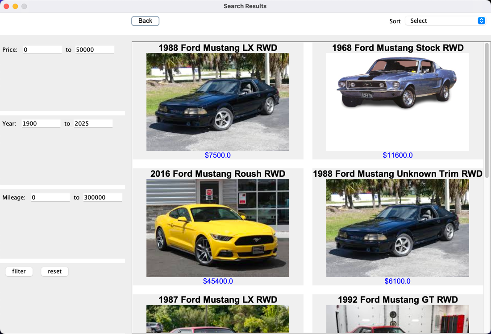

# Manual 

You will update this manual and add any files here that you need for an 'application' manual for your program. Make sure to include screenshots of various features. 
## Start

there are a lot of files in src, and go to App directory, compile the main class App to get start

## Search panel
The first panel you will see is the make-model select panel it has 3 buttons.

- on the left hand side is the model-select button, click on that it will show all the makes that we have in the csv data file, then choose one that you like.
- on the middle is the model-select button, click on that it will show all the models that under the make that you choose, but be aware you must choose make first before click model button. choose a model.
- on the right hand side is the search button, after you choose make and model, you can click on search, it will take you to the next panel that shows the filtered car records.
- it is fine if you dont choose make or model, it will return the car records based on your input(ex. if you want to view all cars, you can leave everything empty and apply search) .

## Result panel

On this panel, you will see car records based on the make and model that you chose. Each record contains basic information about the car along with a picture.

- you can go back to the search panel by clicking on "Back" on the top-left corer.
- on the left hand side, it has multiple filter options, you can apply the filter by entering a amount(ex. price 1000-30000), then click on "filter" to see the filtered result. you can reset the filter by clicking "reset".
- on top-right corner, you will find the sorting options, click on the bar to expend, then choose how you want to sort.
- to view the detailed care information, click on the car image, then it will take you to the next panel.

## Car details panel

Car details panel shows details like engine type, mileages, Drive types ...

- you can go back by clicking "back" on the top-left.
- you can add this car record to wishlist by clicking "Add to Wish List".
- On the top right, you can view the cars that you saved previously and it will take you to wishlist panel.

## Wishlist panel

this panel shows the previous saved car records.

- you can go back by clicking "back" on the top-left.
- you can remove all by clicking "remove all" on the top-right.
- you can remove individual record by clicking "remove" on the right of the car record.